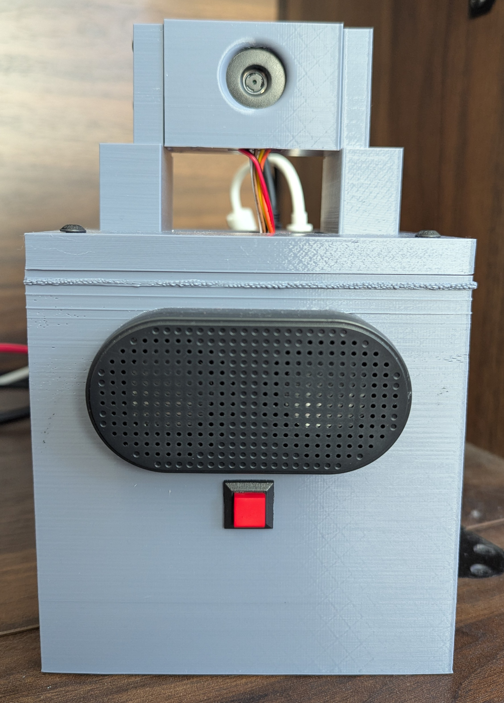
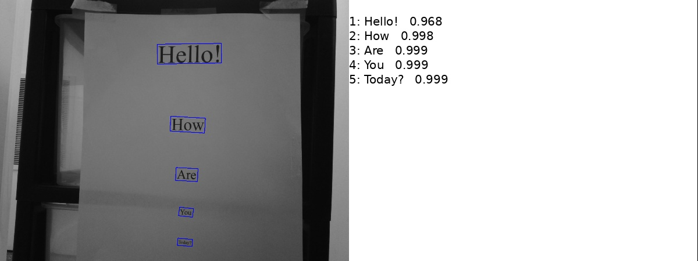
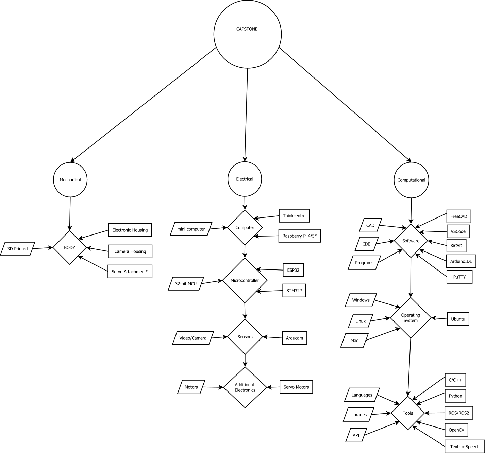

# ARTASA: Automated Robotic Text And Speech Assistant

**Author:** Jerrin C. Redmon  
**Platform:** Raspberry Pi + ESP32  
**Date:** April 15, 2025  

## 🧾 Abstract 

ARTASA, a handheld robotic vision system, is designed to assist individuals who have difficulty reading due to blindness, dyslexia, or other vision impairments. Many people with these conditions struggle to determine whether an object contains text. ARTASA addresses these challenges by processing the environment, detecting and interpreting text, and then converting it into speech using text-to-speech software.

The system utilizes a dedicated Serial Peripheral Interface (SPI) camera module designed to capture images at an optimal resolution and color balance, ensuring efficient processing by the Optical Character Recognition (OCR) system. A Raspberry Pi is employed as a dedicated computer to manage the overall software, enhancing both the speed and accuracy of the process. The system operates through three primary stages: image acquisition, image and text processing, and audio output. For optimal performance, it identifies text with a confidence level of 75% or higher before reading it aloud.

The simple handheld device makes it easy to automatically scan objects, identify and verbalize text. This allows for a compact and adaptable design that can be deployed in various environments.


### 🔧 ARTASA Hardware Unit


---
## 📖 Features
- **Button-triggered OCR pipeline**
- **Speech feedback at every stage**
- **On-boot readiness via systemd service**
- **Real-time communication with an ESP32 camera module over UART**

---

## 🧠 Project Structure

| File                          | Description                                                                 |
|-------------------------------|-----------------------------------------------------------------------------|
| `artasa.service`             | Systemd service to run `artasa_boot.py` on startup                         |
| `artasa_boot.py`             | Startup script that announces readiness and waits for a button press       |
| `artasa_main.py`             | Main logic: captures image, runs OCR, and speaks the detected text         |
| `artasa_camera.ino`          | Arduino/ESP32 sketch that captures a JPEG image upon receiving a command   |

---

## 🖥️ Software Requirements

- **Python 3.8+**
- **PaddleOCR**
- **OpenCV**
- **Piper TTS** (local text-to-speech engine)
- **gpiozero** (for button input)
- **Systemd** (for auto-start on boot)
- **Arducam_Mega**

Install dependencies with:

```bash
pip install paddleocr opencv-python gpiozero
```

Make sure Piper is installed and accessible at:  
`/home/artasa/.local/bin/piper`

---

## 🔧 Hardware Requirements

- Raspberry Pi (tested on Raspberry Pi 5)
- Arducam Mega 5MP SPI camera module
- Push button wired to **GPIO16**
- Speaker (supports `aplay` for audio output)

---

## 🔁 Boot Flow

1. `artasa.service` triggers `artasa_boot.py` on boot.
2. `artasa_boot.py` plays a startup greeting via Piper.
3. Waits for a button press on GPIO16.
4. When pressed, it runs `artasa_main.py`.

---

## ▶️ Main OCR Flow (`artasa_main.py`)
### 🧠 OCR Text Detection Example



- Sends `"CAP"` to ESP32 via serial (`/dev/ttyUSB0`, 921600 baud).
- Receives a JPEG image over serial (detects SOI `0xFFD8` and EOI `0xFFD9` markers).
- Saves image as `image_output.jpg`.
- Runs PaddleOCR and filters text with confidence > **75%**.
- Saves extracted text to `ocr_output.txt`.
- Uses Piper TTS to read out the result.

---

## 📷 ESP32 Firmware (`artasa_camera.ino`)

- Listens for `"CAP"` command over serial.
- Captures and sends image in JPEG format.
- Appends `"DONE"` to indicate completion.

---

## 🔊 Text-to-Speech Function

Both `artasa_boot.py` and `artasa_main.py` use the `say()` function:

```python
subprocess.Popen([
  "piper", "--model", MODEL_PATH,
  "--config", CONFIG_PATH,
  "--output_file", OUTPUT_WAV
], stdin=subprocess.PIPE)
```

This creates and plays a `.wav` file using `aplay`.

---

## 🧠 Systemd Setup

### 1. Install the Service

```bash
sudo cp artasa.service /etc/systemd/system/
sudo systemctl daemon-reexec
sudo systemctl enable artasa.service
sudo systemctl start artasa.service
```

### 2. File Contents (Excerpt)

```ini
[Unit]
Description=ARTASA Boot Service

[Service]
WorkingDirectory=/home/artasa/Desktop/Capstone
ExecStart=/usr/bin/env python3 /home/artasa/Desktop/Capstone/artasa_boot.py
Restart=always
User=artasa
Group=artasa

[Install]
WantedBy=multi-user.target
```

---

## 🚀 Running Manually (Debugging)

If needed, you can run the programs directly:

```bash
python3 artasa_boot.py  # For startup behavior and button handling
python3 artasa_main.py  # To manually run the OCR and speech pipeline
```

---

## 🛠️ Future Improvements

- Add multilingual OCR and speech options.
- Improve serial communication robustness with checksums.
- Add audio feedback for OCR errors or low confidence.

---


### ⚙️ Hardware-Software Interaction Diagram



## 📄 License

MIT License.  
Designed and built by **Jerrin C. Redmon**.

---

## 🧠 Acknowledgments

- [PaddleOCR](https://github.com/PaddlePaddle/PaddleOCR)
- [Piper TTS](https://github.com/rhasspy/piper)
- [OpenCV](https://opencv.org/)
- [Arducam](https://github.com/ArduCAM/Arducam_Mega)
- Raspberry Pi + ESP32 communities

---
